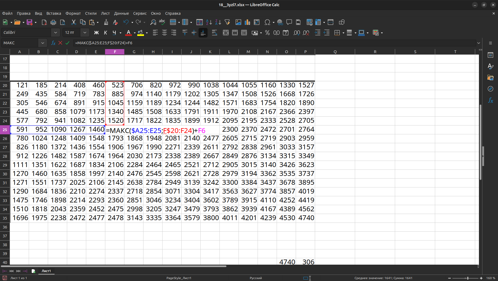
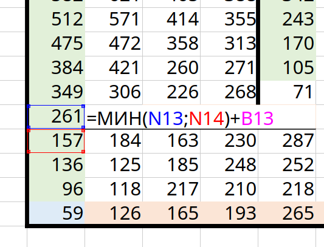
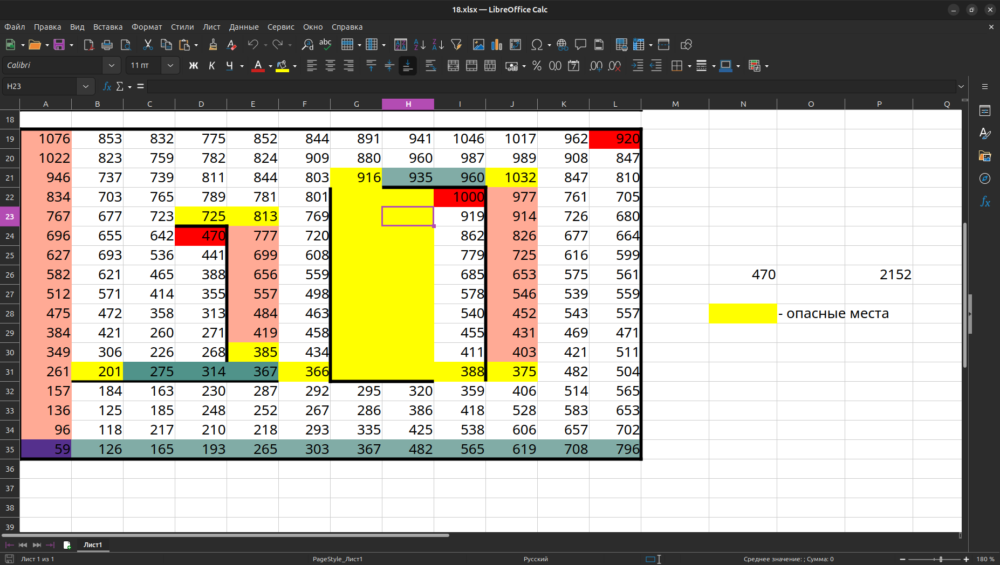
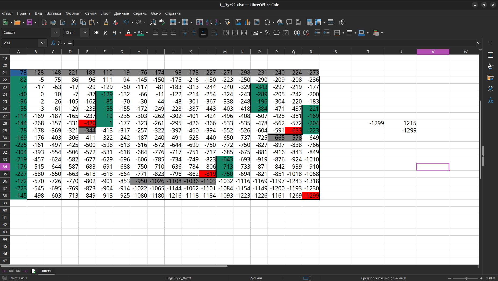
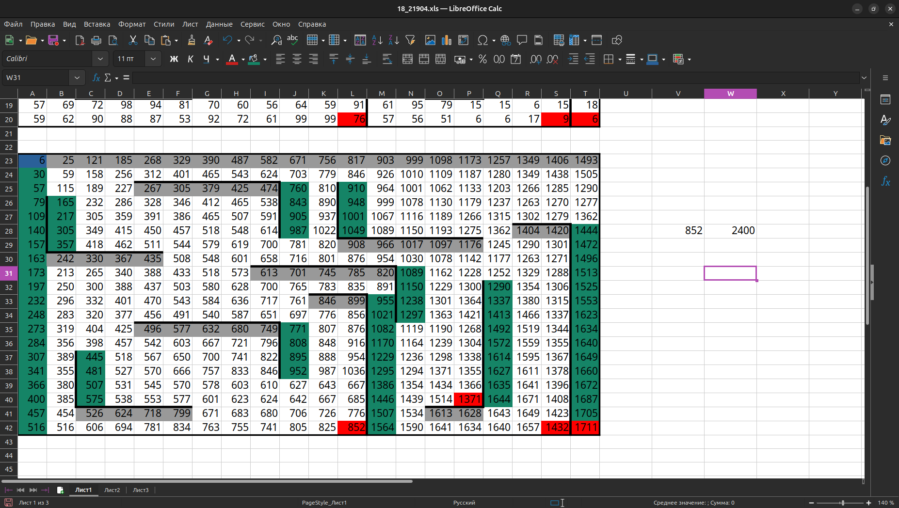
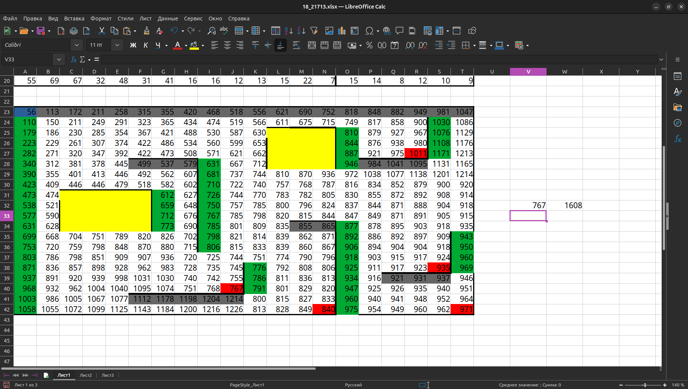

### Ладья 
``=МАКС($A25:E25;F$20:F24)+F6``

### Ход по диагонали

### Прогноз с угловыми клетками и тремя возможными ходами

## Стеночки

## Открытый вариант 2025

## Когда есть уголки в которые робот никакне может попасть то важно ограничинить их с нужной стороны, иначе при поиске минимального значения программа будет захватывать значение из пустой клетке(а это значит брать 0)
