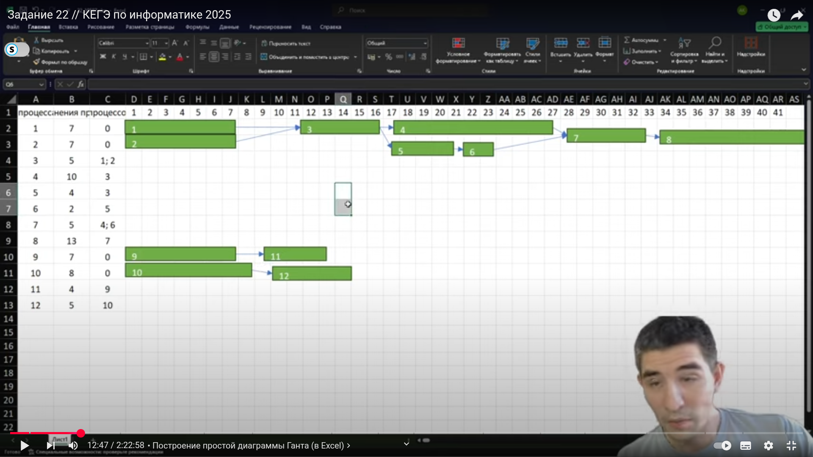
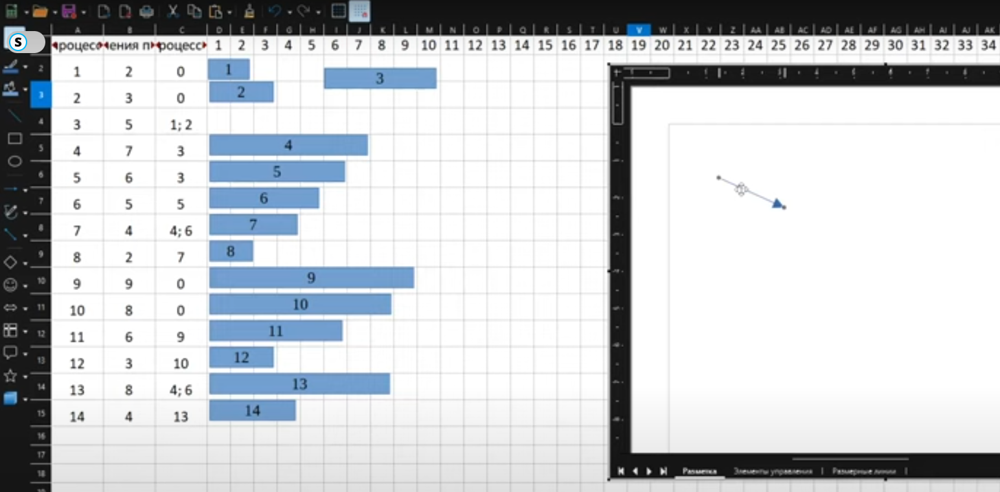
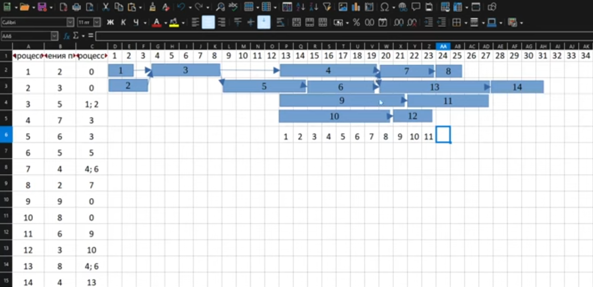
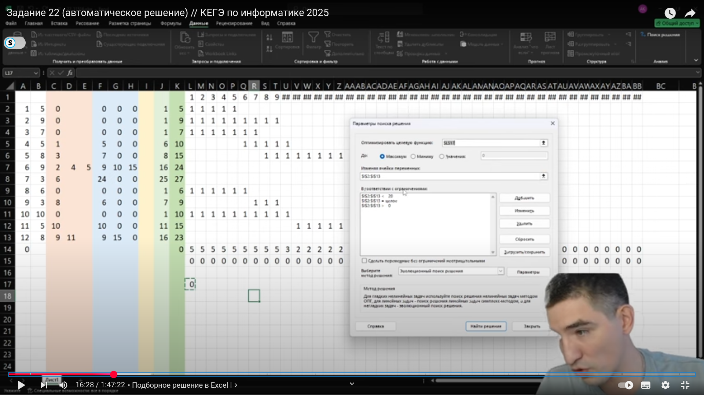
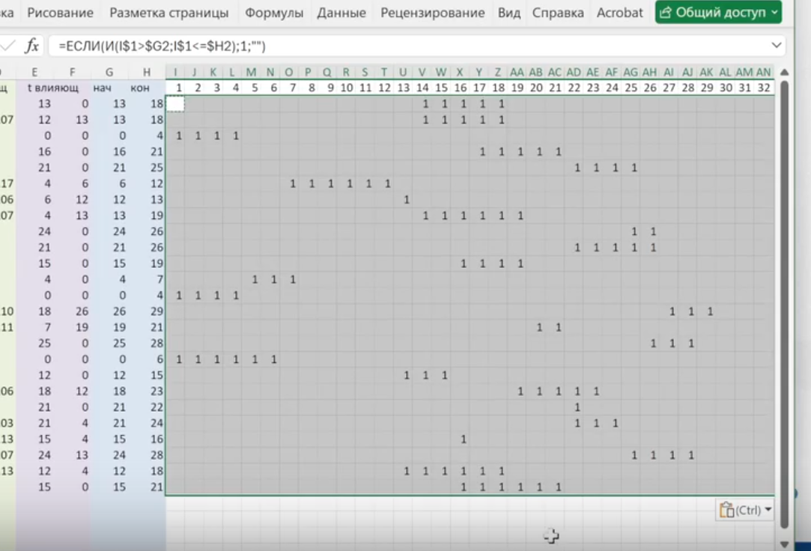

Решая задачу на определение минимального времени завершения всех процессов с помощью ВПР в LibreOffice возникла ошибка 522.
Эта ошибка означает: 

**Циклическая ссылка**

Формула прямым или косвенным образом ссылается на себя, и не настроен параметр Циклы в разделе Сервис - Параметры - LibreOffice Calc - Вычисления - Поставить галочку **Циклические ссылки**


### Решение

1) Разбить процессы, если таких несколько, от которых зависит каждый процесс по отдельным колонкам: Данные - Текст по столбцам - разделитель ;

2) Добавить вниз первого столбца Нулевой процесс (0)

3) Формула в самую правую колонку ```=МАКС(ВПР(C8;A:E;5;0); ВПР(D8;A:E;5;0))+B8```

# вайб
### LibreOffice не предоставляет прямого способа заставить все пустые ячейки вести себя как нули (как в Excel). 
Надо пустые ячейки заполнять нулями


Если в задаче сказано что зависимые процессы могутначать выполняться только спустя n миллисекунд, то добавляем n миллисекунд ко времени завершения процесса только если он зависит от других


## Построение диаграммы Ганта  
В Excel есть "самоклеящаяся" стрелочка для соединения прямоугольников продолжительности процессов


В Libre Office Calc такой стрелочки нет. Чтобы ее достать нужно: Вставка - Обьект OLE - Обьект OLE - Рисунок Libre Office.

Появится поле для рисования, а справа боковая панель, где нужно выбрать **соединительные линии** - **прямая соединительная линия со стрелкой на конце** и нарисовать ее в поле.

Затем копируем ее из поля и вставляем в саму таблицу





## Автоматическое решение с использованием сдвигов процессов и встроенной функции в Excel Поиск решения
https://www.youtube.com/watch?v=yP_D_vDaSBc


### Первая волна 10 июня
