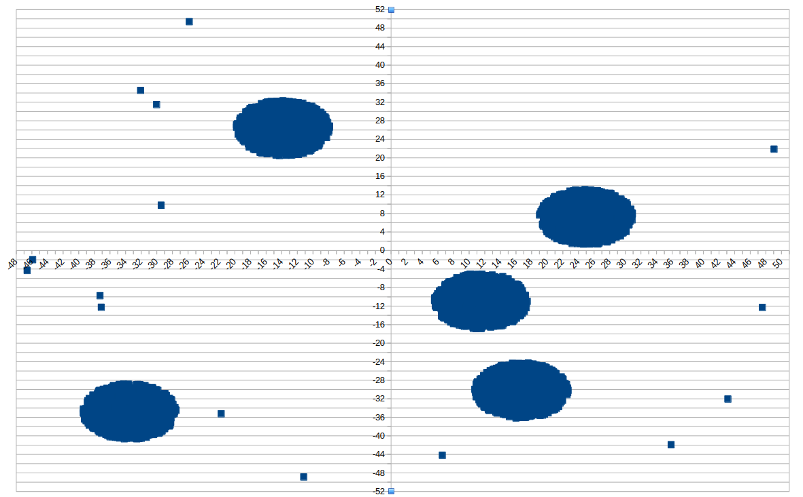

## Этап 1: визуализация 

#### В Libre Office:
Выделяешь таблицу -> Вставка -> Диаграмма -> XY (разброс)

#### В Excel: 
Выделяешь таблицу -> Вставка -> Точечная диаграмма 

Далее если можно легко разделить кластеры с помощью прямых, то подбираем координаты ограничивающих прямых
Иначе используем метод DBSCAN


## Этап 2: кластеризация 
1) Можно использовать уравнения прямых x и y.
2) Для более точного разделения при наличии одиночных звезд может потребоваться использование двойных неравенств:
``` if (2 <= x < = 5) and (3 <= y <= 7):```


3) С помощью уравнения прямых

```    if (x / 11) > ((y -3) / 3):```

4) Уравнение окружности


5) В трехмерном пространстве добавляется координата z.
И чтобы провизуализировать кластеры в Excel надо создать 3 диаграммы попарно совмещая координаты.


Разделение можно проводить на основе только одной координаты X

6) Разделение прямоугольниками из статьи Полякова
